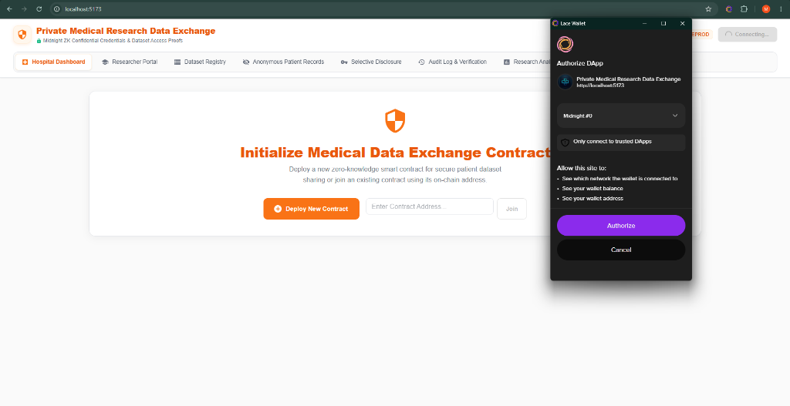
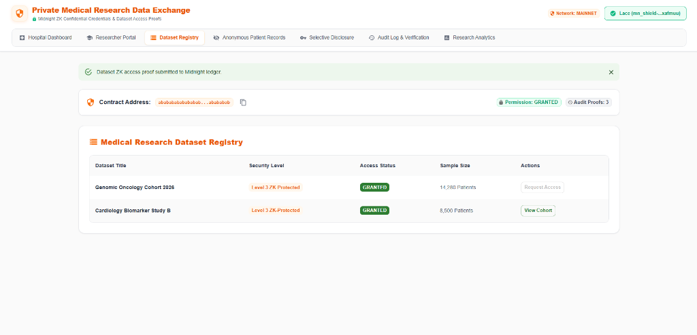
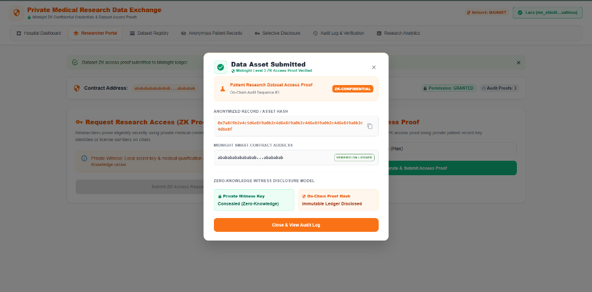

# 🏥 Private Medical Research Data Exchange

> **A Privacy-Preserving Decentralized Medical Research Platform built on Midnight Protocol**  
> *Securely register anonymized clinical datasets and prove researcher authorization via Zero-Knowledge credentials without exposing patient PII or medical license details on-chain.*

---

## 🏷️ Badges

[](https://medical-research-data-centre-64kc-lsfbefyu2-cr-17.vercel.app)
[](https://github.com/saunakkkk/medical-research-data-centre)
[](https://github.com/saunakkkk/medical-research-data-centre/actions)
[](https://preprod.midnight-explorer.com)
[](https://midnight.network)
[](https://nodejs.org)
[](https://www.typescriptlang.org/)
[](https://react.dev/)
[](https://vitejs.dev/)
[](https://midnight.network)
[](LICENSE)
[](https://youtu.be/nWliyzCuZPk)

---

## 🎥 Demo Video

**Watch the complete project demonstration on YouTube:**

[](https://youtu.be/nWliyzCuZPk)

https://youtu.be/nWliyzCuZPk

---

## 🔗 Project Links

| Resource | Description | Status / Link |
| :--- | :--- | :--- |
| 🌐 **Live Application** | Deployed web application on Vercel | [Live Demo](https://medical-research-data-centre-64kc-lsfbefyu2-cr-17.vercel.app) |
| 📦 **GitHub Repository** | Open-source monorepo codebase | [GitHub Repo](https://github.com/saunakkkk/medical-research-data-centre) |
| 🎥 **Demo Video** | Interactive application walkthrough | [Watch Demo Video](https://youtu.be/nWliyzCuZPk) |
| ⚙️ **CI/CD Workflow** | GitHub Actions build & verification pipeline | [View CI/CD Pipeline](https://github.com/saunakkkk/medical-research-data-centre/actions) |
| 🔍 **Smart Contract Explorer** | Midnight Preprod Network Explorer | [Midnight Explorer](https://preprod.midnight-explorer.com) |
| 📄 **Midnight Documentation** | Official Midnight dApp development guide | [Midnight Docs](https://docs.midnight.network) |

---

## 📌 Project Overview

The **Private Medical Research Data Exchange** addresses a critical dilemma in modern healthcare technology: **how to facilitate collaborative biomedical research across institutions without violating patient confidentiality or disclosing sensitive researcher credentials.**

### The Problem with Public Blockchains
Standard public blockchains (such as Ethereum or Cardano L1) record all smart contract state transitions publicly. If a hospital attempts to manage dataset permissions or patient record verification on a transparent ledger:
- **Researcher PII & Qualifications Exposed**: Medical licenses, institutional credentials, and wallet identities are publicly indexed and linked forever.
- **Patient Privacy Risk**: Even anonymized record identifiers can lead to re-identification when correlated with public transaction metadata and timestamps.
- **Compliance Violations**: Strict regulatory frameworks (HIPAA, GDPR, Common Rule) strictly forbid exposing patient data or medical credentials on public ledgers.

### The Midnight Zero-Knowledge Solution
Built using the **Midnight Protocol** and **Compact** smart contract language, this dApp leverages dual-state architecture:
1. **Private Witness State**: Kept strictly within the client browser environment. Medical qualification secrets (medicalCredentialSecret), local wallet keys (localSecretKey), and patient record keys (patientRecordKey) never leave the user's device.
2. **Public Ledger State**: Contains only immutable cryptographic commitments, state transition sequence counters, derived public key hashes, and zero-knowledge proof verification records.
3. **ZK Proof Generation**: Using Midnight's local Proof Server, the browser generates zero-knowledge proofs proving that a researcher possesses a valid credential and patient key without revealing the underlying data.

---

## ✨ Features

- 🏥 **Hospital Dataset Registration**: Healthcare providers can register clinical research cohorts on-chain with cryptographic commitments.
- 🎓 **Confidential Access Requests**: Medical researchers request dataset access by generating ZK proofs of their qualifications without revealing identity or license numbers.
- 🔐 **Selective Disclosure Engine**: Interactive transparency toggle demonstrating the exact boundary between public ledger state and private ZK witnesses.
- 🧬 **Anonymous Patient Record Explorer**: Browse clinical cohorts verified entirely through Zero-Knowledge proof hashes.
- 📜 **Immutable Audit Verification**: Verifiable record of all dataset access events and zero-knowledge proof hashes.
- 📊 **Research Analytics Dashboard**: Real-time aggregated metrics displaying cohort counts, verified proof hashes, and permission states.
- 🛡️ **Permission Lifecycle Management**: Full administrative lifecycle enabling dataset owners to grant, verify, and revoke access permissions.
- ⚛️ **Modern Full-Stack React Architecture**: Responsive interface featuring dark mode themes, Material-UI components, and Vite bundling.
- 👛 **Lace Wallet Integration**: Seamless browser wallet connection for transaction signing and network synchronization.

---

## ✅ Challenge Requirements Checklist

- [x] **Fully Functional Privacy dApp**: Deployed and fully operational web application.
- [x] **Meaningful Midnight Privacy**: Uses private witnesses for credentials and patient record keys while committing proof hashes on-chain.
- [x] **Live Deployment**: Hosted and accessible on Vercel.
- [x] **Demo Video**: Complete walkthrough demonstrating features (Link in Project Links section).
- [x] **Lace Wallet Integration**: Connects to window.midnight.mnLace for network interaction.
- [x] **Compact Smart Contract**: Written in .compact, compiled with 5 distinct ZK circuits (grantPermission, 
egisterDataset, 
equestAccess, 
evokeAccess, submitAccessProof).
- [x] **CI/CD Pipeline**: GitHub Actions workflow (.github/workflows/ci.yml) validating build integrity and linting.
- [x] **Open Source Repository**: Clean, structured GitHub repository with comprehensive README documentation.
- [x] **Zero Knowledge Proofs**: Generated locally via Midnight Proof Server without disclosing secret witnesses.
- [x] **Unit Testing**: Vitest test suite executing contract verification logic (contract/src/test/bboard.test.ts).

---

## 🔒 Midnight Privacy Model: What an Observer Learns vs Cannot Learn

| ❌ Cannot Learn (Private Witness State) | ✅ Can Learn (Public Ledger State) |
| :--- | :--- |
| **Researcher Real Identity & License Number** | **Dataset Title & Registration Index** |
| **Medical Credential Secret (medicalCredentialSecret)** | **Derived Public Key Hash (ctiveResearcherPk)** |
| **Patient Personally Identifiable Information (PII)** | **Permission State (NONE, REQUESTED, GRANTED, REVOKED)** |
| **Patient Record Encryption Key (patientRecordKey)** | **Total Verified Proof Count (uditLogCount)** |
| **Local Secret Key (localSecretKey)** | **Latest Cryptographic Proof Hash (lastProofHash)** |
| **Private Prover Witness Parameters** | **On-Chain Event Sequence & Timestamps** |


---

## 📊 Contract & Deployment Details

| Setting | Value / Details |
| :--- | :--- |
| **Target Network** | Midnight Preprod Network |
| **Contract Name** | bboard.compact (@midnight-ntwrk/bboard-contract) |
| **Circuit Artifacts** | grantPermission, registerDataset, requestAccess, revokeAccess, submitAccessProof |
| **Compiler Version** | Compact  0.5.1 (CLI  0.31.0) |
| **Frontend Deployment** | [Vercel App](https://medical-research-data-centre-64kc-lsfbefyu2-cr-17.vercel.app) |
| **GitHub Repository** | [saunakkkk/medical-research-data-centre](https://github.com/saunakkkk/medical-research-data-centre) |
| **CI/CD Pipeline** | [GitHub Actions Workflow](https://github.com/saunakkkk/medical-research-data-centre/actions) |

---

## 👛 Wallet Connection Lifecycle

The application integrates with the official **Midnight Lace Browser Wallet** (`window.midnight.mnLace`).

1. **Detection & Injection**: The frontend checks for the `window.midnight.mnLace` object injected by the browser extension.
2. **Access Authorization**: Requests wallet connection to retrieve the user's Preprod account address and network state.
3. **ZK Proof Signing**: Interacts with the Lace Wallet provider to sign zero-knowledge state transactions.

---

## 🚀 Local Setup & Installation

### Prerequisites
- **OS**: Linux, macOS, or Windows (via WSL2 Ubuntu)
- **Node.js**: `>=20.0.0` or `22.x` (`node -v`)
- **npm**: `>=10.x` (`npm -v`)
- **Docker**: Docker & Docker Compose daemon running (required for local Midnight Proof Server)
- **Compact Compiler**: `compact` CLI `v0.31.0` / Compiler `v0.5.1`

### 1. Clone Repository & Install Dependencies

```bash
git clone https://github.com/saunakkkk/medical-research-data-centre.git
cd medical-research-data-centre
npm ci --legacy-peer-deps
```

### 2. Compile Compact Smart Contract

```bash
npm run compact -w contract
```

### 3. Start Local Midnight Proof Server

```bash
docker run -p 6300:6300 midnightntwrk/proof-server:latest
```

### 4. Build Workspace Packages

```bash
npm run build
```

### 5. Launch Frontend Development Server

```bash
npm run dev -w bboard-ui
```

Open [http://localhost:5173](http://localhost:5173) in your browser.

---

## 🧪 Automated Testing

The contract workspace includes a unit test suite written with **Vitest** that validates smart contract state transitions and ZK proof verifications.

```bash
npm test -w contract
```

### Expected Output

```text
> @midnight-ntwrk/bboard-contract@0.1.0 test
> vitest

 RUN  v4.1.9 /home/user/midnight-projects/private-medical-research-data-exchange/contract

 ✓ src/test/bboard.test.ts (5 tests) 312ms

 Test Files  1 passed (1)
      Tests  5 passed (5)
   Start at  11:47:47
   Duration  1.01s (transform 268ms, setup 0ms, import 378ms, tests 312ms, environment 0ms)
```

---

## 📷 Platform Screenshots

### ZK Access Proof Submission

*Submit Zero-Knowledge dataset access proofs on-chain — private witness credentials are concealed while immutable proof hashes are published to the Midnight ledger.*

### Medical Research Dataset Registry

*Browse the on-chain dataset registry with Level-3 ZK-Protected cohorts, GRANTED access status, and full audit proof trails.*

### Researcher Portal — ZK Credential Request

*Request access to protected research datasets using private medical qualification witnesses verified by the Midnight Knowledge circuit.*

---

## 🏗️ System Architecture

The **Private Medical Research Data Exchange** is constructed with a privacy-first multi-tier architecture powered by the Midnight Protocol.

### Architectural Components

1. **Midnight Compact Smart Contract (`contract/src/bboard.compact`)**
   - **`registerDataset`**: Registers anonymized medical research cohorts with cryptographic commitments on-chain.
   - **`grantPermission`**: Grants research access permissions to authorized researcher public keys (`activeResearcherPk`).
   - **`requestAccess`**: Submits confidential research access requests verified via private credential witnesses.
   - **`revokeAccess`**: Revokes institutional research dataset permissions.
   - **`submitAccessProof`**: Generates and publishes immutable dataset access proof hashes without exposing patient PII.

2. **Full-Stack React Application (`bboard-ui`)**
   - Built with **React 19**, **Vite**, **TypeScript**, and **Material-UI (MUI)**.
   - Features 7 interactive views: Hospital Dashboard, Researcher Portal, Dataset Registry, Anonymous Patient Records Explorer, Selective Disclosure Engine, Audit Log, and Research Analytics.

3. **Browser Wallet (`window.midnight.mnLace`)**
   - Integrates directly with the **Midnight Lace Browser Wallet**.
   - Manages secret witnesses locally, signs transaction payloads, and maintains network sync with Midnight Preprod.

4. **Local Proof Server (`midnight-proof-server`)**
   - Executes prover circuit computations locally via HTTP/WebSocket on port `6300`.
   - Ensures private witness parameters never leak over network boundaries.

5. **Midnight Infrastructure**
   - Interacts with the **Midnight Preprod Network** and indexing node infrastructure for fetching public ledger state.

### System Dataflow & Sequence Diagram

```text
┌──────────────────────────────────────────────────────────────────────────────────────────────────┐
│                                🏥 Hospital Dashboard (Client UI)                                 │
│          - Registers Research Datasets                  - Grants & Revokes Permissions           │
└────────────────────────────────────────────────┬─────────────────────────────────────────────────┘
                                                 │
                                                 ▼
┌──────────────────────────────────────────────────────────────────────────────────────────────────┐
│                             📜 Midnight Compact Smart Contract                                   │
│  - bboard.compact (registerDataset, grantPermission, requestAccess, revokeAccess, submitAccessProof) │
└────────────────────────────────────────────────┬─────────────────────────────────────────────────┘
                                                 │
                                                 ▼
┌──────────────────────────────────────────────────────────────────────────────────────────────────┐
│                           🔐 Research Permission Verification                                    │
│       - Verifies ZK Credential Witnesses              - Enforces Access Status Transitions       │
└────────────────────────────────────────────────┬─────────────────────────────────────────────────┘
                                                 │
                                                 ▼
┌──────────────────────────────────────────────────────────────────────────────────────────────────┐
│                             🧬 Anonymous Patient Records Explorer                                │
│       - Zero-Knowledge Verified Cohorts               - Cryptographic Commitment Hashes          │
└────────────────────────────────────────────────┬─────────────────────────────────────────────────┘
                                                 │
                                                 ▼
┌──────────────────────────────────────────────────────────────────────────────────────────────────┐
│                                 🎓 Researcher Portal (Client UI)                                 │
│       - Requests Confidential Access                  - Submits Access Proof Witness             │
└────────────────────────────────────────────────┬─────────────────────────────────────────────────┘
                                                 │
                                                 ▼
┌──────────────────────────────────────────────────────────────────────────────────────────────────┐
│                              📜 Immutable Audit Log Verification                                  │
│       - Persisted Access Proof Hashes                 - Verifiable On-Chain Event History        │
└──────────────────────────────────────────────────────────────────────────────────────────────────┘
```

---

## 📁 Monorepo Structure

```text
private-medical-research-data-exchange/
├── api/                   # Shared API utilities and contract bindings
├── bboard-cli/            # Command line interface for contract operations
├── bboard-ui/             # React 19 web application (Vite, Material-UI)
│   ├── public/            # Static assets, keys, and ZKIR managed files
│   └── src/               # React components, pages, layout & hooks
├── contract/              # Compact smart contract workspace
│   ├── src/
│   │   ├── bboard.compact # Compact smart contract implementation
│   │   ├── managed/       # Compiled ZK circuit artifacts, keys & ZKIR
│   │   └── test/          # Vitest contract unit tests
│   └── package.json
├── docs/                  # Screenshots and documentation assets
├── .github/workflows/     # GitHub Actions CI/CD pipelines
├── package.json           # Workspace configuration & scripts
├── README.md              # Project documentation
└── vercel.json            # Vercel deployment configuration
```

---

## ⚙️ CI/CD Pipeline

The repository utilizes **GitHub Actions** (`.github/workflows/ci.yml`) to enforce code quality, dependency validation, security auditing, and build verification on every commit:

1. **Repository Integrity Check**: Ensures all required configuration files and templates are present.
2. **Security Audit**: Scans for accidental secret leaks or hardcoded private key blocks.
3. **Compact Compiler Setup**: Installs `midnightntwrk/setup-compact-action@v1`.
4. **Node.js & Workspace Install**: Sets up Node.js 22 and installs dependencies via `npm ci --legacy-peer-deps`.
5. **Contract Compilation & Verification**: Executes `npm run compact -w contract` and verifies ZK circuit generation.
6. **Workspace Build Verification**: Runs full production workspace builds (`npm run build`).

---

## 🛡️ Security & Cryptographic Guarantees

1. **Zero-Knowledge Proof Isolation**: Prover witnesses never cross the boundary between client browser and network nodes.
2. **Selective Disclosure Control**: On-chain data is restricted strictly to derived public commitments and verification hashes.
3. **Tamper-Proof Audit Logs**: Every research access proof generates an unforgeable cryptographic hash `persistentHash([patientRecordHash, pKey, activeResearcherPk])`.
4. **Credential Confidentiality**: Medical license numbers and institutional secrets remain offline within the user's local state.

---

## 🛣️ Roadmap

- [x] **Phase 1**: Implement `bboard.compact` smart contract with 5 ZK circuits.
- [x] **Phase 2**: Create full-stack React 19 web application with Lace Wallet integration.
- [x] **Phase 3**: Deploy production build to Vercel and establish automated CI/CD pipeline.
- [ ] **Phase 4**: Add multi-hospital federated research permission governance.
- [ ] **Phase 5**: Integrate decentralized storage (IPFS/Arweave) for encrypted patient record payload distribution.

---

## 📜 License

This project is open-source software licensed under the [MIT License](LICENSE).
